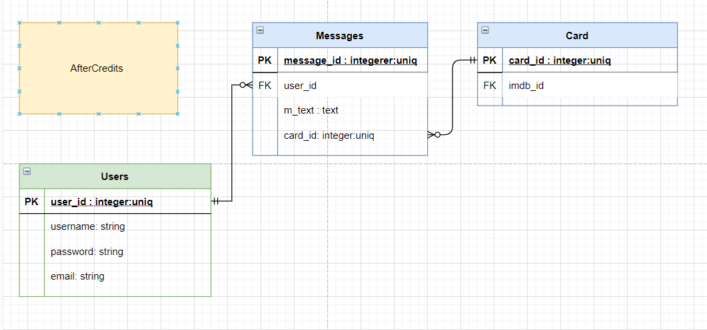
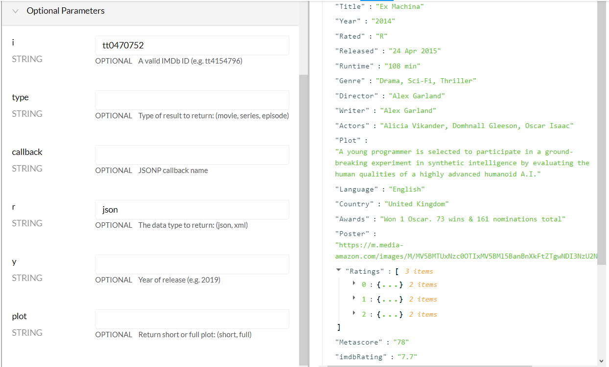

#### SETUP
1. Install dependencies by running the following in your command line terminal: $ bundle install
Open the directory in your default text editor: $ code .

2. PostgreSQL database setup
Open your database.yml file and customise the following to your specifications at development and test, e.g:
  username: postgres    
  password: xxxxxxxx
  host: localhost
  port: 5432

3. Setup the database and populate preset data from the seeds file by running the following commands in terminal: $rails db:reset

$rails db:create
$rails db:migrate
$rails db:seed

Note that if you already have a database then you can drop before creating, migrating and seeding the database. Drop using $rails db:drop

4. Confirm proper installation and setup
Start your server by running: $ rails s
Open the following url in your browser: http://localhost:3000/
The page should load without error.

#### ERD UPDATED
NOTE: Messages not created with date and time stamp - check chatti to see if this was done from creation time stamp (automaticaly created)
NOTE: Also check auth and knock again (not scaffold, but model - double check)

Message belongs to user. Message belongs to card. ERD amended.
1. rails g scaffold Cards imdb_id:string 
2. rails g model Users username:string email:string password:string
3. rails g scaffold Messages m_text:text user:references card:references
** CHECK WHETHER VIEWS NEED TO ME REMOVED BEFORE INTEGRATION AND BEST WAY TO DO SO (i.e. rollback required or a new and seperate destroy type command. May need to raise Trello card for educators)

#### This Rails App is an API
Rails is set up as an api (see notes in routes.rb file)
CARD API: This rails api sends data from the postgress database to the react front end. This is seperate from the third party rapid api.
MESSAGES API: This rails api sends data from the postgress database to the react front end.

#### THIRD PARTY API
Expect this data: https://rapidapi.com/rapidapi/api/movie-database-imdb-alternative/

