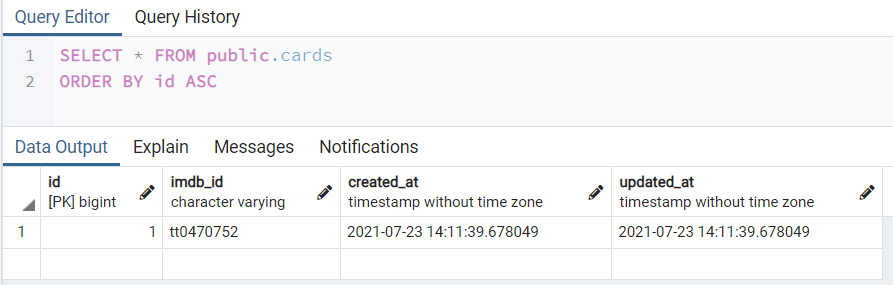

DATABASE:
rails db:drop
rails db:create
rails db:migrate
rails db:seed 

Both developers need to update their local database.yml for their systems &
need the content of the .gitignore and .env files for local development

NOTE: Messages not created with date and time stamp - check chatti to see if this was done from creation time stamp (automaticaly created)
NOTE: Also check auth and knock again (not scaffold, but model - double check)

Message belongs to user. Message belongs to card. ERD amended.
1. rails g scaffold Cards imdb_id:string 
2. rails g model Users username:string email:string password:string
3. rails g scaffold Messages m_text:text user:references card:references

Initial seeds file has created one card for development in the interim: imdb_id: tt0470752

Expect this data: https://rapidapi.com/rapidapi/api/movie-database-imdb-alternative/
